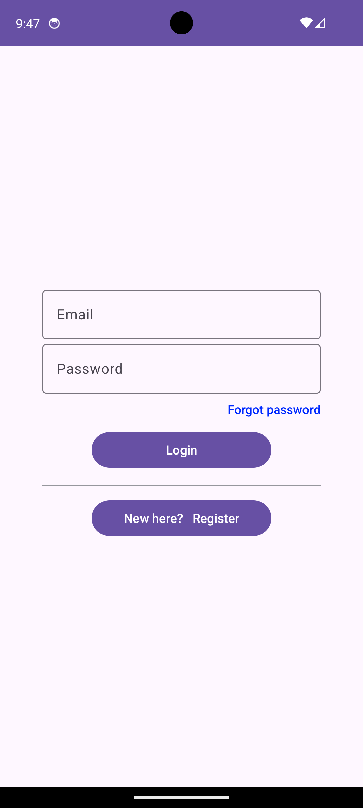
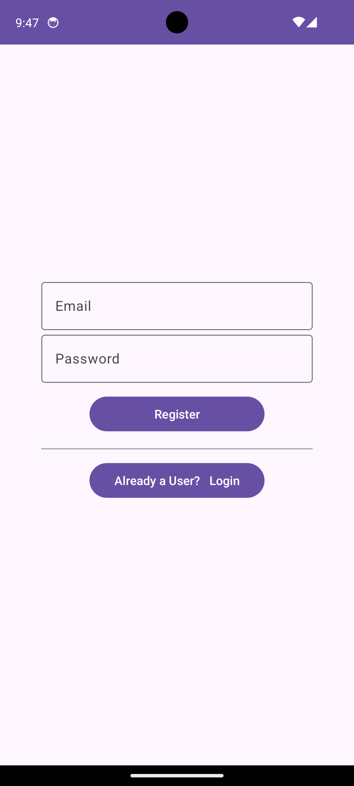
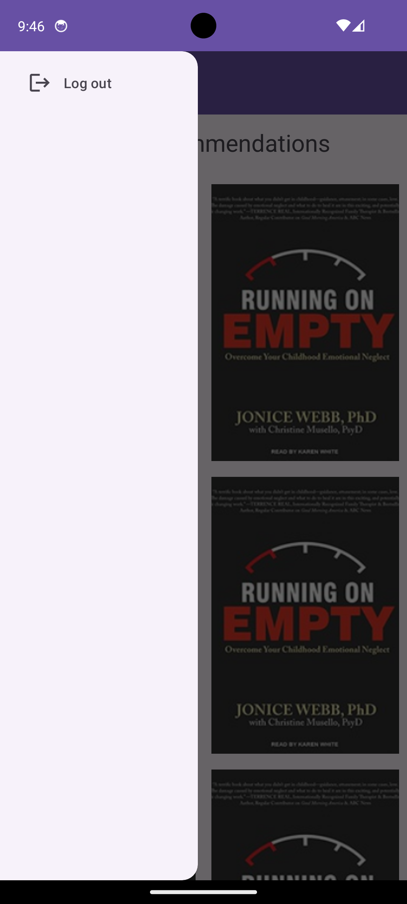
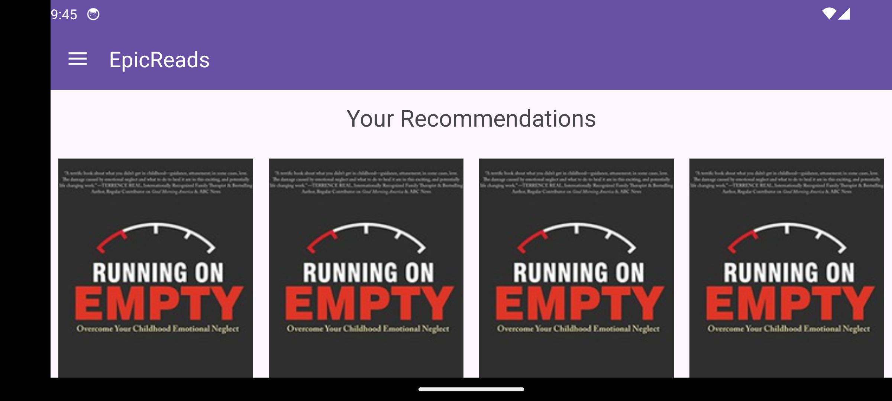

# EpicReads Book Recommendation App

    
    

The following concepts are used
- Retrofit for images
- MVVM to seperate image fetch from Model and View
- Firebase for login/register
- Drawer Layout

    
    
    

    
    

 
